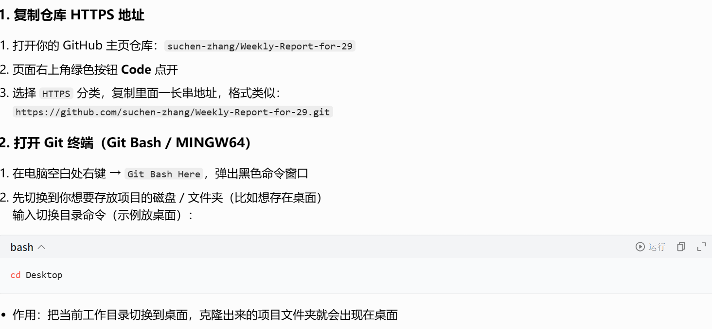
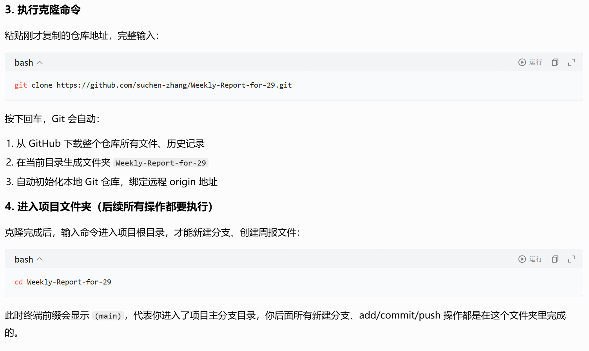
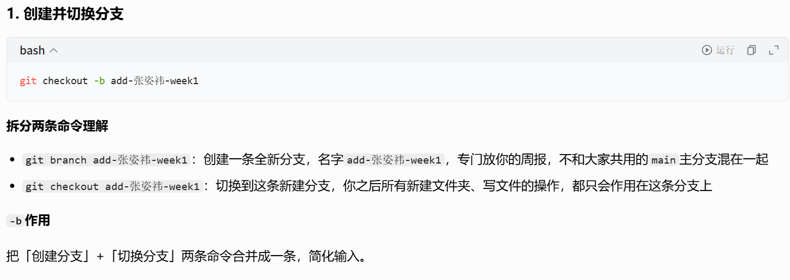
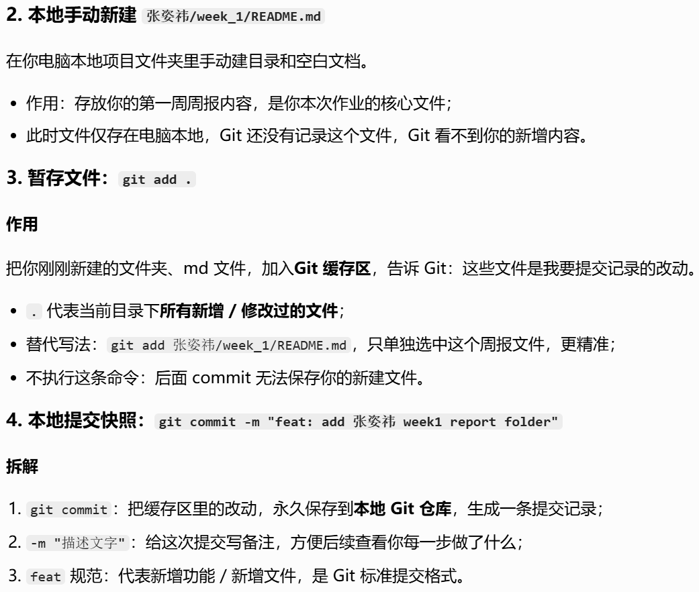
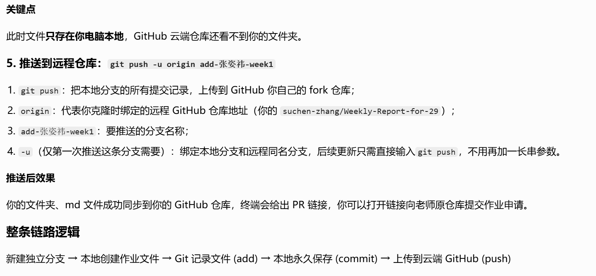
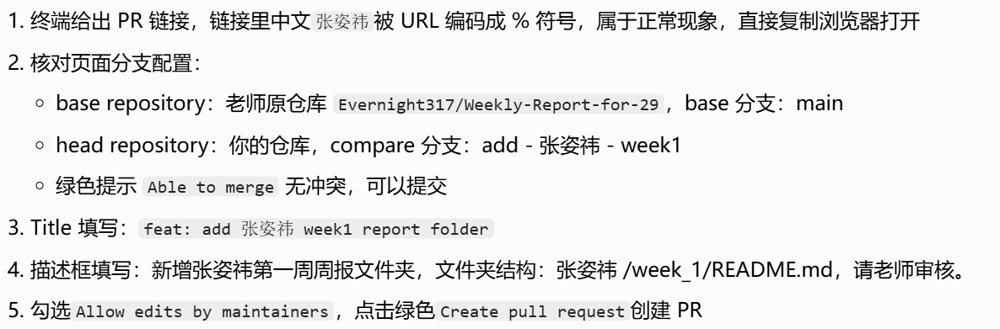
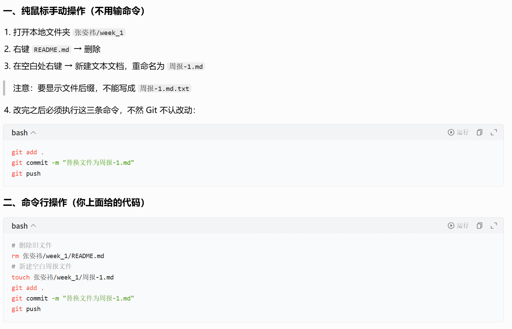

# Git学习
## 一：前置：拿到老师仓库，克隆到本地
- 
- 
## 二：新建独立分支，创建个人周报文件夹
- 
- 
- 
- 注意：GitHub 禁止账号密码登录推送，弹出密码框报错 User cancelled dialog。按照指引：点击右上角头像→Settings→Developer settings→Personal access tokens (classic)，生成永久 repo 权限令牌，复制令牌粘贴到密码弹窗，完成推送，终端出现 [new branch] add-张姿祎-week1 -> add-张姿祎-week1，代表成功推送到你自己的 GitHub 仓库
## 三：网页发起 Pull Request（提交作业给老师审核）
- 
## 四：后续修改周报文件相关操作
- 